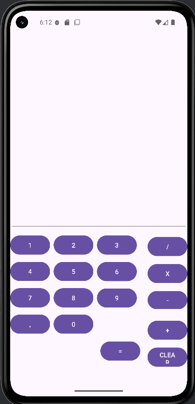
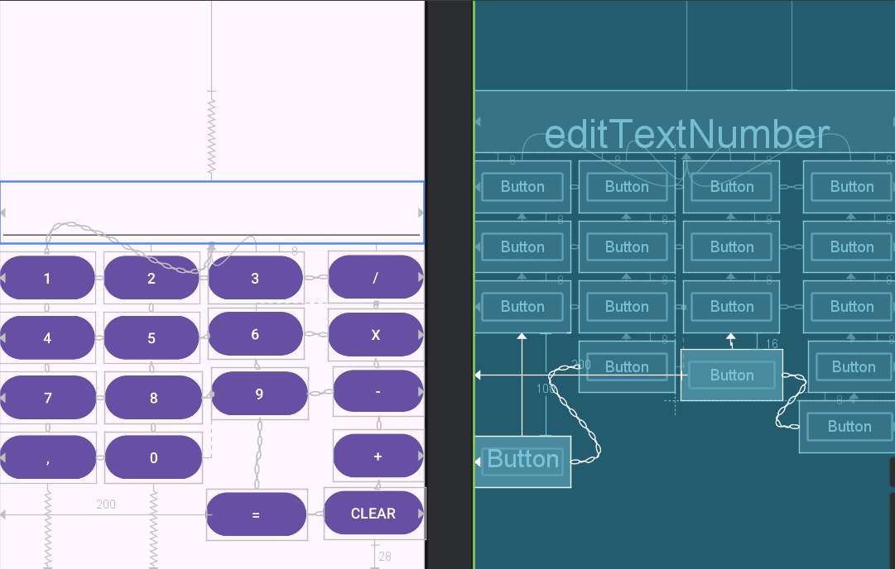

# Calculadora - Alejandro Gómez de Juan

## Índice

**1. [Comentarios interesantes o Problemas](#1-comentarios-interesantes-o-problemas)**

**2. [Ejecución](#2-ejecución)**

**3. [Diseño](#3-diseño)**  

**4. [Código](#4-código)**


## 1. Comentarios interesantes o Problemas

- **1:** He tenido problemas con la columna de la derecha del todo al intentar unirlas todas con ConstraintLayout.

- **2:** He tenido problemas al colocar los botones cuando ya tenia las ConstraintLayout creadas.

## 2. Ejecución



## 3. Diseño



## 4. Código

```xml
    <?xml version="1.0" encoding="utf-8"?>
<androidx.constraintlayout.widget.ConstraintLayout xmlns:android="http://schemas.android.com/apk/res/android"
    xmlns:app="http://schemas.android.com/apk/res-auto"
    xmlns:tools="http://schemas.android.com/tools"
    android:id="@+id/main"
    android:layout_width="match_parent"
    android:layout_height="match_parent"
    tools:context=".MainActivity">
    
    <EditText
        android:id="@+id/editTextNumber"
        android:layout_width="0dp"
        android:layout_height="60dp"
        android:layout_marginTop="264dp"
        android:gravity="end"
        android:inputType="number"
        android:padding="8dp"
        android:textSize="24sp"
        app:layout_constraintBottom_toTopOf="@+id/poner_uno"
        app:layout_constraintEnd_toEndOf="parent"
        app:layout_constraintHorizontal_bias="0.5"
        app:layout_constraintStart_toStartOf="parent"
        app:layout_constraintTop_toTopOf="parent"
        app:layout_constraintVertical_chainStyle="packed" />

    <Button
        android:id="@+id/poner_uno"
        android:layout_width="0dp"
        android:layout_height="50dp"
        android:layout_marginTop="8dp"
        android:layout_marginEnd="8dp"
        android:text="@string/poner_uno"
        app:layout_constraintBottom_toTopOf="@+id/poner_cuatro"
        app:layout_constraintEnd_toStartOf="@id/poner_dos"
        app:layout_constraintHorizontal_bias="0.5"
        app:layout_constraintStart_toStartOf="parent"
        app:layout_constraintTop_toBottomOf="@+id/editTextNumber" />

    <Button
        android:id="@+id/poner_dos"
        android:layout_width="0dp"
        android:layout_height="50dp"
        android:layout_marginTop="8dp"
        android:layout_marginEnd="8dp"
        android:text="@string/poner_dos"
        app:layout_constraintBottom_toTopOf="@+id/poner_cinco"
        app:layout_constraintEnd_toStartOf="@id/poner_tres"
        app:layout_constraintHorizontal_bias="0.5"
        app:layout_constraintStart_toEndOf="@id/poner_uno"
        app:layout_constraintTop_toBottomOf="@+id/editTextNumber"
        app:layout_constraintVertical_bias="0.0"
        app:layout_constraintVertical_chainStyle="packed" />

    <Button
        android:id="@+id/poner_tres"
        android:layout_width="0dp"
        android:layout_height="50dp"
        android:layout_marginTop="8dp"
        android:text="@string/poner_tres"
        app:layout_constraintEnd_toStartOf="@id/poner_dividir"
        app:layout_constraintStart_toEndOf="@id/poner_dos"
        app:layout_constraintTop_toBottomOf="@id/editTextNumber" />

    <Button
        android:id="@+id/poner_dividir"
        android:layout_width="0dp"
        android:layout_height="50dp"
        android:layout_marginStart="24dp"
        android:layout_marginTop="2dp"
        android:text="@string/poner_dividir"
        app:layout_constraintBottom_toTopOf="@+id/poner_multiplicar"
        app:layout_constraintEnd_toEndOf="parent"
        app:layout_constraintHorizontal_bias="0.5"
        app:layout_constraintStart_toEndOf="@id/poner_tres"
        app:layout_constraintTop_toBottomOf="@+id/editTextNumber" />

    <Button
        android:id="@+id/poner_cuatro"
        android:layout_width="0dp"
        android:layout_height="50dp"
        android:layout_marginTop="8dp"
        android:layout_marginEnd="8dp"
        android:text="@string/poner_cuatro"
        app:layout_constraintBottom_toTopOf="@+id/poner_siete"
        app:layout_constraintEnd_toStartOf="@id/poner_cinco"
        app:layout_constraintHorizontal_bias="0.5"
        app:layout_constraintStart_toStartOf="parent"
        app:layout_constraintTop_toBottomOf="@+id/poner_uno" />

    <Button
        android:id="@+id/poner_cinco"
        android:layout_width="0dp"
        android:layout_height="50dp"
        android:layout_marginTop="8dp"
        android:layout_marginEnd="8dp"
        android:text="@string/poner_cinco"
        app:layout_constraintBottom_toTopOf="@+id/poner_ocho"
        app:layout_constraintEnd_toStartOf="@id/poner_seis"
        app:layout_constraintHorizontal_bias="0.5"
        app:layout_constraintStart_toEndOf="@id/poner_cuatro"
        app:layout_constraintTop_toBottomOf="@+id/poner_dos" />

    <Button
        android:id="@+id/poner_seis"
        android:layout_width="0dp"
        android:layout_height="50dp"
        android:layout_marginTop="5dp"
        android:text="@string/poner_seis"
        app:layout_constraintBottom_toTopOf="@+id/poner_nueve"
        app:layout_constraintEnd_toStartOf="@id/poner_multiplicar"
        app:layout_constraintHorizontal_bias="0.5"
        app:layout_constraintStart_toEndOf="@id/poner_cinco"
        app:layout_constraintTop_toBottomOf="@+id/poner_dividir" />

    <Button
        android:id="@+id/poner_multiplicar"
        android:layout_width="0dp"
        android:layout_height="50dp"
        android:layout_marginStart="24dp"
        android:text="@string/poner_multiplicar"
        app:layout_constraintBottom_toTopOf="@+id/poner_restar"
        app:layout_constraintEnd_toEndOf="parent"
        app:layout_constraintHorizontal_bias="0.5"
        app:layout_constraintStart_toEndOf="@id/poner_seis"
        app:layout_constraintTop_toBottomOf="@+id/poner_dividir" />

    <Button
        android:id="@+id/poner_siete"
        android:layout_width="0dp"
        android:layout_height="50dp"
        android:layout_marginTop="8dp"
        android:layout_marginEnd="8dp"
        android:text="@string/poner_siete"
        app:layout_constraintBottom_toTopOf="@+id/poner_coma"
        app:layout_constraintEnd_toStartOf="@id/poner_ocho"
        app:layout_constraintHorizontal_bias="0.5"
        app:layout_constraintStart_toStartOf="parent"
        app:layout_constraintTop_toBottomOf="@+id/poner_cuatro" />

    <Button
        android:id="@+id/poner_ocho"
        android:layout_width="0dp"
        android:layout_height="50dp"
        android:layout_marginTop="8dp"
        android:layout_marginEnd="8dp"
        android:text="@string/poner_ocho"
        app:layout_constraintBottom_toTopOf="@+id/poner_cero"
        app:layout_constraintEnd_toStartOf="@id/poner_nueve"
        app:layout_constraintHorizontal_bias="0.5"
        app:layout_constraintStart_toEndOf="@id/poner_siete"
        app:layout_constraintTop_toBottomOf="@+id/poner_cinco" />

    <Button
        android:id="@+id/poner_nueve"
        android:layout_width="0dp"
        android:layout_height="50dp"
        android:layout_marginTop="8dp"
        android:text="@string/poner_nueve"
        app:layout_constraintBottom_toTopOf="@+id/poner_igual"
        app:layout_constraintEnd_toStartOf="@id/poner_restar"
        app:layout_constraintHorizontal_bias="0.5"
        app:layout_constraintStart_toEndOf="@id/poner_ocho"
        app:layout_constraintTop_toBottomOf="@+id/poner_seis" />

    <Button
        android:id="@+id/poner_restar"
        android:layout_width="wrap_content"
        android:layout_height="wrap_content"
        android:layout_marginStart="24dp"
        android:layout_marginBottom="8dp"
        android:text="@string/poner_restar"
        app:layout_constraintBottom_toTopOf="@+id/poner_sumar"
        app:layout_constraintEnd_toEndOf="parent"
        app:layout_constraintHorizontal_bias="0.5"
        app:layout_constraintStart_toEndOf="@id/poner_nueve"
        app:layout_constraintTop_toBottomOf="@+id/poner_multiplicar" />

    <Button
        android:id="@+id/poner_coma"
        android:layout_width="0dp"
        android:layout_height="50dp"
        android:layout_marginTop="8dp"
        android:layout_marginEnd="8dp"
        android:text="@string/poner_coma"
        android:textSize="14sp"
        app:layout_constraintBottom_toBottomOf="parent"
        app:layout_constraintEnd_toStartOf="@id/poner_cero"
        app:layout_constraintStart_toStartOf="parent"
        app:layout_constraintTop_toBottomOf="@+id/poner_siete"
        app:layout_constraintHorizontal_bias="0.5" />

    <Button
        android:id="@+id/poner_cero"
        android:layout_width="0dp"
        android:layout_height="50dp"
        android:layout_marginTop="8dp"
        android:layout_marginEnd="8dp"
        android:text="@string/poner_cero"
        app:layout_constraintBottom_toBottomOf="parent"
        app:layout_constraintEnd_toStartOf="@id/poner_nueve"
        app:layout_constraintHorizontal_bias="0.5"
        app:layout_constraintStart_toEndOf="@id/poner_coma"
        app:layout_constraintTop_toBottomOf="@+id/poner_ocho" />

    <Button
        android:id="@+id/poner_sumar"
        android:layout_width="0dp"
        android:layout_height="50dp"
        android:text="@string/poner_sumar"
        app:layout_constraintBottom_toTopOf="@+id/poner_clear"
        app:layout_constraintEnd_toEndOf="parent"
        app:layout_constraintTop_toBottomOf="@+id/poner_restar" />

    <Button
        android:id="@+id/poner_clear"
        android:layout_width="0dp"
        android:layout_height="50dp"
        android:layout_marginBottom="28dp"
        android:text="@string/poner_clear"
        app:layout_constraintBottom_toBottomOf="parent"
        app:layout_constraintEnd_toEndOf="parent"
        app:layout_constraintHorizontal_bias="0.5"
        app:layout_constraintStart_toEndOf="@+id/poner_igual"
        app:layout_constraintTop_toBottomOf="@+id/poner_sumar" />

    <Button
        android:id="@+id/poner_igual"
        android:layout_width="0dp"
        android:layout_height="50dp"
        android:layout_marginStart="200dp"
        android:layout_marginTop="67dp"
        android:layout_marginEnd="16dp"
        android:text="@string/poner_igual"
        app:layout_constraintEnd_toStartOf="@id/poner_clear"
        app:layout_constraintHorizontal_bias="0.0"
        app:layout_constraintStart_toStartOf="parent"
        app:layout_constraintTop_toBottomOf="@+id/poner_nueve" />


</androidx.constraintlayout.widget.ConstraintLayout>
```
